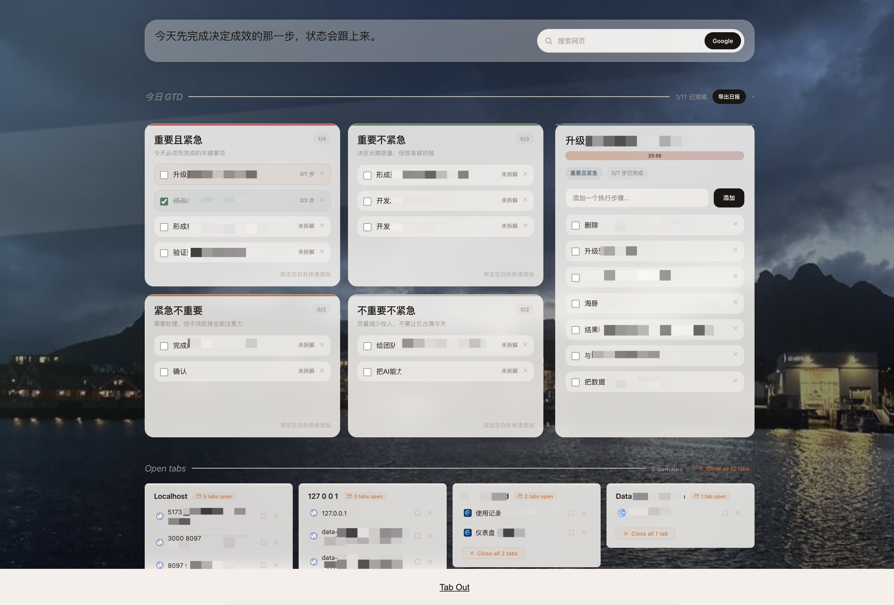

# Tab Out

**Keep tabs on your tabs.**

[中文说明](./README.zh-CN.md)

Tab Out is a Chrome extension that replaces your new tab page with a personal workspace. It combines open-tab management with a GTD dashboard, step-by-step execution lists, focus tools, search, and a more atmospheric visual layer.

No server. No account. Just a Chrome extension with local storage and lightweight background image sources.



---

## Install with a coding agent

Send your coding agent (Claude Code, Codex, etc.) this repo and say **"install this"**:

```
https://github.com/fishandfly/tab-out
```

The agent will walk you through it. Takes about 1 minute.

---

## Features

- **GTD dashboard** with a four-quadrant layout for important/urgent planning, inline task editing, drag-and-drop, and daily markdown export
- **Pomodoro focus mode** built into the active task so you can start, pause, and reset a 25-minute session directly from the checklist panel
- **Rotating background photography** with epic and sports themes that periodically refresh to keep the page feeling energetic
- **Google search in the header** so every new tab can immediately become your default search entry point
- **Motivational quotes** that rotate through a large local set of encouragement lines to keep the page optimistic and work-oriented
- **See all your tabs at a glance** on a clean grid, grouped by domain
- **Homepages group** pulls Gmail inbox, X home, YouTube, LinkedIn, GitHub homepages into one card
- **Close tabs with style** with swoosh sound + confetti burst
- **Duplicate detection** flags when you have the same page open twice, with one-click cleanup
- **Click any tab to jump to it** across windows, no new tab opened
- **Save for later** bookmark tabs to a checklist before closing them
- **Localhost grouping** shows port numbers next to each tab so you can tell your vibe coding projects apart
- **Expandable groups** show the first 8 tabs with a clickable "+N more"
- **100% local** your data never leaves your machine
- **Pure Chrome extension** no server, no Node.js, no npm, no setup beyond loading the extension

---

## Why These Features Exist

Chrome is the tool I open most often every day, so I wanted the new tab page to do more than organize tabs. I wanted the highest-frequency page in my workflow to help me focus on the work that actually matters.

My time is usually fragmented, which makes it easy to stay busy without holding onto the real priority of the day. That is why this fork adds a GTD board and a Pomodoro timer directly into the new tab page: the goal is to make focus unavoidable at the exact moment I am most likely to drift.

I also did not want the page to feel too rigid or mechanical. The rotating background photography and motivational quotes are there on purpose. They add a little emotional energy and help the workspace feel alive instead of purely functional.

I chose Google search in the header instead of Baidu because I wanted to reduce the time lost to distracting news feeds and information streams. The idea is simple: search quickly, get what you need, and return to work.

The GTD behavior is intentionally strict. If a task is not finished today, it does not automatically roll over to tomorrow. The next day starts clean. If something still matters, it must be entered again. I dislike repeated input enough that this rule becomes pressure to actually finish what I planned.

That combination is what makes this new tab page my current best workspace.

---

## Manual Setup

**1. Clone the repo**

```bash
git clone https://github.com/fishandfly/tab-out.git
```

**2. Load the Chrome extension**

1. Open Chrome and go to `chrome://extensions`
2. Enable **Developer mode** (top-right toggle)
3. Click **Load unpacked**
4. Navigate to the `extension/` folder inside the cloned repo and select it

**3. Open a new tab**

You'll see Tab Out.

---

## Share With Teammates

Run the packaging script:

```bash
./package-extension.sh
```

It will generate a shareable zip in `release/`.

Your teammates can then:

1. Open `chrome://extensions`
2. Enable **Developer mode**
3. Unzip the package
4. Click **Load unpacked**
5. Select the unzipped extension folder

---

## How it works

```
You open a new tab
  -> Tab Out shows your open tabs grouped by domain
  -> Homepages (Gmail, X, etc.) get their own group at the top
  -> Click any tab title to jump to it
  -> Close groups you're done with (swoosh + confetti)
  -> Save tabs for later before closing them
```

Everything runs inside the Chrome extension. There is no separate backend service, and your GTD data is stored in `chrome.storage.local`.

---

## Tech stack

| What | How |
|------|-----|
| Extension | Chrome Manifest V3 |
| Storage | chrome.storage.local |
| Sound | Web Audio API (synthesized, no files) |
| Animations | CSS transitions + JS confetti particles |

---

## License

MIT

---

Built by [Zara](https://x.com/zarazhangrui)
